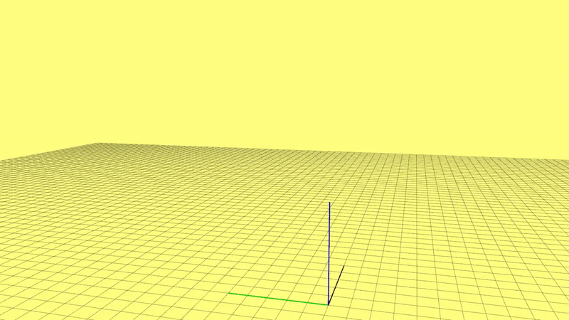

# TimeOptimizer
## 1.Introduction

TimeOptimizer is a tool to do **re-timing** (time optimization) of an **arbitrary** piecewise polynomial-based trajectory (no matter monomial polynomial, Bezier curve, B-spline or others). The objective of this work is to map the original parametrization variable to a new variable (time), with which the trajectory can finish as fast as possible and respect all kinodynamic limits (velocity, accleration).
For details we refer readers to our paper.

**Authors:**[Fei Gao](https://ustfei.com/) and [Shaojie Shen](http://www.ece.ust.hk/ece.php/profile/facultydetail/eeshaojie) from the [HUKST Aerial Robotics Group](uav.ust.hk).

**Disclaimer**

This is research code, any fitness for a particular purpose is disclaimed.

**Related Paper**
* **Optimal Time Allocation for Quadrotor Trajectory Generation,** Fei Gao, William Wu, Jie Pan, Boyu Zhou and Shaojie Shen, IEEE/RSJ International Conference on Intelligent Robots and Systems (IROS), 2018, Madrid, Spain.
[full text](https://ecefeigao.files.wordpress.com/2018/08/iros2018fei.pdf)

Video of this paper can be found:

<a href="https://www.youtube.com/watch?v=YJdwyJ5h8Ac" target="_blank"></a>


If you use this planning framework for your academic research, please cite our related paper.
```
@inproceedings{Fei2018IROS,
	Address = {Madrid, Spain},
	Author = {F. Gao and W.Wu and J. Pan and B. Zhou and S. Shen},
	Booktitle = {Optimal Time Allocation for Quadrotor Trajectory Generation},
	Title = {Proc. of the {IEEE/RSJ} Intl. Conf. on Intell. Robots and Syst.({IROS})},
	Month = Oct,
	Year = {2018}}
}
```
**Implementation**

## 2.Prerequisities
- Our testing environment: **Ubuntu** 16.04, **ROS** Kinetic.
- If you want to use the interactive tool to set waypoints for the trajectory, please follow **5.1** to compile the tools in folder 'utils'. Otherwise just clone this package and compile and run. Remember to approve a license from **mosek** following **4**.

## 3.Build on ROS
  Clone the repository to your catkin workspace and catkin_make. For example:
```
  cd ~/catkin_ws/src
  git clone https://github.com/HKUST-Aerial-Robotics/TimeOptimizer.git
  cd ../
  catkin_make
  source ~/catkin_ws/devel/setup.bash
```

## 4.Install Mosek
We use **mosek** for solvingsecond-order cone program(SOCP). To use mosek, you should approve an academic license in [here](https://www.mosek.com/products/academic-licenses/). The academic license is free and is easy to approve. Then create a folder named 'mosek' in your home directory and put your license in it. All header and library files are already included in the 'third_party' folder under this repo, so you don't need to download mosek again. 

## 5.Usage
If you have done all above, you can try the simple demo in two ways.

**1.**
We provide a clean launch file which has no dependence on other packages, suppose you do not want to configure the interactive tools we provide. In this way, you can write down you the coordinates of all waypoints in the **traj.json** file under the root directory of this package, and the program would read it after launching:
```
  roslaunch time_optimizer clean_demo.launch
```



**2.**
If you want to use the interactive tools we provide. Delete the file named 'CATKIN_IGNORE' under the directories of two additional ros-packages **rviz_plugins** and **waypoint_generator** in **utils**, and run 'catkin_make' to compile them.

Then run following command:
```
  roslaunch time_optimizer inte_demo.launch
```
In rviz, click 'Panels -> tools -> +' and select the plugin 'Goal3DTool'. If you have successfully compiled all packages from [plan_utils](https://github.com/HKUST-Aerial-Robotics/plan_utils), now you can see *3D Nav Goal* in the tools panel.

We use *3D Nav Goal* to send waypoints for the drone. To use it, click the tool (shortcut keyboard 'g' may conflict with *2D Nav Goal*), then press on left mouse button on a position in rviz, click right mouse button to start to drag it slide up or down for a targeting height (don't loose left button at this time). Finally you loose left mouse button and a series of waypoints will be sent to the planner, done.


## 6.Visualization the results
The entire pipeline is : setting waypoints -> generating spatial trajectory -> time optimization -> publishing commands (position, velocity, acceleration). Commands can be viewed in rviz. Then, if you want to plot all commands of the final trajectory, plese run:
```
  roscd time_optimizer
  sudo chmod +x draw.py
  python draw.py
```

## 7.Acknowledgements
  We use [mosek](https://www.mosek.com/) for solving second-order cone program(SOCP).

## 8.Licence
The source code is released under [GPLv3](http://www.gnu.org/licenses/) license.

## 9.Notes
- The code has not been deeply tested, if you find any problems, do not hesitate to raise a issue or write e-mail to me.
